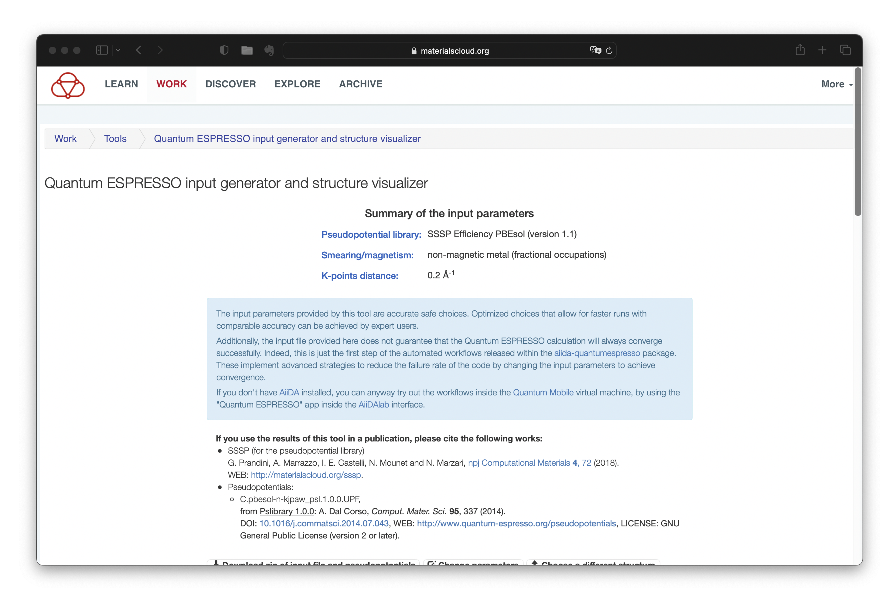

.. _Materials_Cloud:

:orphan:

Using Materials Cloud to visualize a crystal structure
======================================================

Molecules and crystals can be visualized using softwares such as `XCrySDen <http://www.xcrysden.org>`_, `VESTA <https://jp-minerals.org/vesta/en/>`_ and `VMD <http://www.ks.uiuc.edu/Research/vmd/>`_, but sometimes there are difficulties in installing these softwares into the computer we are using, say during a workshop like the CMD workshop. In such a circumstance, it is quite useful to use web-based tools. `Quantum ESPRESSO input generator and structure visualizer <https://www.materialscloud.org/work/tools/qeinputgenerator>`_ very useful, not only for visualization, but also to create a template for a Quantum-ESPRESSO calculation. Below, I describe how to use the structure viewer by taking graphene as an example.

Visit the `Materials Cloud <https://www.materialscloud.org/work/tools/qeinputgenerator>`_ site:

Download your XSF file, say, ``C2.xsf`` to your local computer, and choose it on the web page:

Then you can see the following images:

And by scrolling down ...:

Just follow the instruction given in the page. by choosing supercell dimension, we can see something like this:

