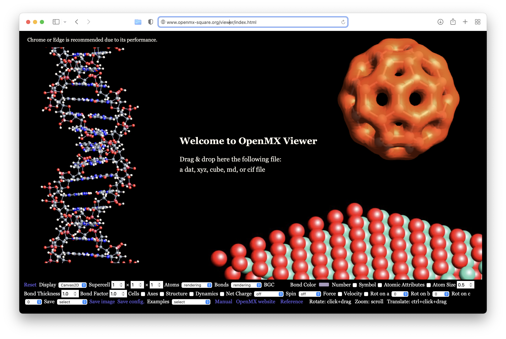
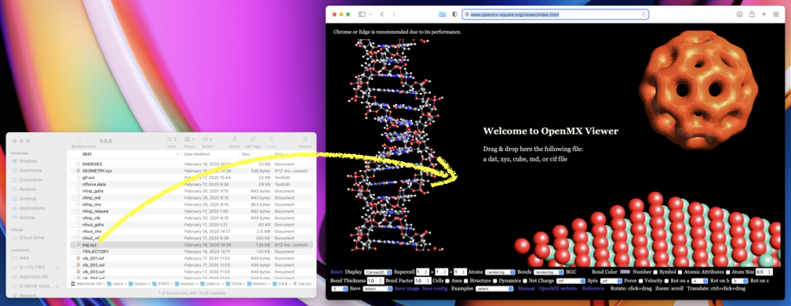
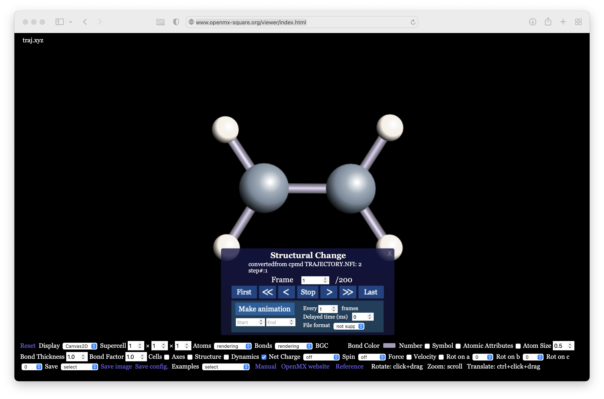

.. _openmx_viewer:

:orphan:

Using OpenMX Viewer to visualize the molecular dynamics
=======================================================

Molecules and crystals can be visualized using softwares such as `XCrySDen <http://www.xcrysden.org>`_, `VESTA <https://jp-minerals.org/vesta/en/>`_ and `VMD <http://www.ks.uiuc.edu/Research/vmd/>`_, but sometimes there are difficulties in installing these softwares into the computer we are using, say during a workshop like the CMD workshop. In such a circumstance, it is quite useful to use web-based tools. Among others, I find `OpenMX Viewer <http://www.openmx-square.org/viewer/index.html>`_ very useful. Below, I describe how to use OpenMX Viewer by using the C\ :sub:`2`\H\ :sub:`4`\  as an example.

Visit the `OpenMX Viewer <http://www.openmx-square.org/viewer/index.html>`_ site:

Download your trajectory file, say, ``traj.xyz`` to your local computer, and then drag and drop your trajectory file as suggested in the web page:
(In case you have difficulty in producing the trajectory file, download/copy it from `here <https://github.com/ikuhamada/state-examples/blob/4a663dc31935a68616b023243987f2f2cb91b913/C2H4/References/5.6.6/traj.xyz>`_)

Then you can see the following image:

By clicking the ``>>`` botton, you can see the atoms moving.

