.. _CMD43_SC:

============================
Supercomputer course @ CMD43
============================

Welcome to the STATE hands-on tutorial at CMD43. In the following, how to run the STATE examples for this hands on is desdribed.  A documentation of the STATE code can be found `here <https://state-doc.readthedocs.io>`_.

.. warning::
	This page is under construction

Getting started
===============

First of all, we log in to the supercomputer system (ohtaka) at ISSP, The University of Tokyo.

.. code:: bash

  $ ssh -Y [user_name]@ohtaka.issp.u-tokyo.ac.jp

or

.. code:: bash

  $ ssh -Y -l [user_name] ohtaka.issp.u-tokyo.ac.jp

where [user_name] is your user name assigned.

.. code:: bash

  $ git clone -b cmd_sc https://github.com/ikuhamada/state-setup.git STATE

See also `my github page <https://github.com/ikuhamada/state-setup/tree/cmd_sc>`_.

Then, go to the STATE directory 

.. code:: bash

  $ cd STATE

and execute the following

.. code:: bash

  $ ./state-setup.sh

and we are almost there!

Now you can find the directories by typing ``ls`` as::

  examples/  gncpp/  src/

and we are ready to build the STATE executable. Let us moved to the source directory

.. code:: bash

  $ cd src/state/src

and execute the following

.. code:: bash

  $ ln -s ../arch/make.arch.intel_ohtaka_scalapack make.arch

and build the STATE code by executing ``make``

.. code:: bash

  $ make > make.log 2>&1&

``make.log`` is a log file for the build and the file name can be anything. It takes few minutes to complete the build.
If successfull, we get the following message

.. code:: bash

  [1]+  Done                    make > make.log 2>&1

Then let us also build the utility programs. Go to the utility directory

.. code:: bash

  $ cd ../util

and ``make``

.. code:: bash

  $ make > make.log 2>&1&

Just make sure the utility programs are in your command search path, please type the following

.. code:: bash

  $ source ~/.bashrc

If the builds are done successfully, we are now ready to run the STATE program!

Let us move to ``${HOME}/STATE/examples`` to run the examples.

Carbon monoxide
===============

As the first example, let us use the carbon monoxide (CO) molecule in a box.
Go to ``CO`` in the examples directory, and  have a look at by ``cat nfinp_scf``

.. code:: bash

  WF_OPT    DAV
  NTYP      2
  NATM      2
  GMAX      5.50
  GMAXP     20.00
  NSCF      200
  WAYMIX    3
  KBXMIX    8
  MIX_ALPHA 0.8
  WIDTH     0.0010
  EDELTA    0.1000D-09
  NEG       8
  CELL      6.00  4.00  4.00  90.00  90.00  90.00
  &ATOMIC_SPECIES
   C  12.011  pot.C_pbe1
   O  15.999  pot.O_pbe1
  &END
  &ATOMIC_COORDINATES
    0.0000  0.0000  0.0000  1  1  1
    2.2000  0.0000  0.0000  1  1  2
  &END

Short description of the input variables can be found :doc:`here <co>`

Let us review the job script by ``cat run.sh``
(very short description on the available queues and job script can be found :doc:`here <ohtaka>`

.. code:: bash

  #!/bin/sh
  #SBATCH -J  CO
  #SBATCH -p  cmdinteractive
  #SBATCH -N  1
  #SBATCH -n  4
  
  # Load the modules
  
  module load intel_compiler/2020.4.304
  module load intel_mpi/2020.4.304
  module load intel_mkl/2020.4.304
  
  # Set the executable of the STATE code
  
  ln -fs ${HOME}/STATE/src/state/src/STATE
  
  # Set the pseudopotential data
  
  ln -fs ../gncpp/pot.C_pbe1
  ln -fs ../gncpp/pot.O_pbe1
  
  # Set the input/output files
  
  INPUT_FILE=nfinp_scf
  OUTPUT_FILE=nfout_scf
  
  # Run!
  
  ulimit -s unlimited
  
  srun ./STATE < ${INPUT_FILE} > ${OUTPUT_FILE}

and submit!

.. code:: bash

  $ sbatch run.sh

The output ``nfout_scf`` starts with the header

.. code:: bash

   ***********************************************************************
   *                                                                     *
   *                                                                     *
   *                                                                     *
   *              ******  ********    **    ******** ********            *
   *             ******** ********   ****   ******** ********            *
   *             **          **     **  **     **    **                  *
   *              ***        **    ********    **    ******              *
   *                ***      **   **********   **    ******              *
   *                  **     **  **        **  **    **                  *
   *             ********    ** **          ** **    ********            *
   *              ******     ** VERSION 5.6.9  **    ********            *
   *                               RICS-AIST                             *
   *                           OSAKA UNIVERSITY                          *
   *                                                                     *
   ***********************************************************************

and at the convergence, total energy, its components, and Fermi energy are printed as

.. code:: bash

                       TOTAL ENERGY AND ITS COMPONENTS 
                    TOTAL ENERGY     =         -22.21942426 A.U.
                  KINETIC ENERGY     =           9.92111407 A.U.
                  HARTREE ENERGY     =           5.12121800 A.U.
                       XC ENERGY     =          -5.89585641 A.U.
                    LOCAL ENERGY     =         -20.23161604 A.U.
                 NONLOCAL ENERGY     =           6.73686140 A.U.
                    EWALD ENERGY     =         -17.87114528 A.U.
                       PC ENERGY     =           0.00000000 A.U.
                 ENTROPIC ENERGY     =           0.00000000 A.U.
  
                                           FERMI ENERGY =       0.43248213
  
along with the forces acting on atoms

.. code:: bash

      ATOM              COORDINATES                        FORCES
  MD:    1
  MD:    1  C   0.000000   0.000000   0.000000   0.01852 -0.00000 -0.00000
  MD:    2  O   2.200000   0.000000   0.000000  -0.01858  0.00000 -0.00000

Congratulations! We see the victory cat at the end of the output file:-)

.. code:: bash

   HHHHHHHHHHHHHHHHHHHHHHHHHHHHHHHHHHHHHHHHHHHHHHHHHHHHHHHHHHHHHHHHH
   HHHHHHHHHHHHHHHHHHHHHHHHHHHHHHHHHHHHHHHHHHHHHHHHHHHHHHHHHHHHHHHHH
                             _______________________
       __________   _______/______v______v______v___]
      D          | |                                 |
      D   A A    | | Congratulations!                |  C( > < )D
    --  =(^.^)=  | |  The calculation has converged. |    = o =
   |     @@@@@   | |                                 |    (    )~
   /--=O=-+-=O=---+--=O=--+--==O==--+--==O==--+--=O=-+--=O=---=O=-/
    
   HHHHHHHHHHHHHHHHHHHHHHHHHHHHHHHHHHHHHHHHHHHHHHHHHHHHHHHHHHHHHHHHH
   HHHHHHHHHHHHHHHHHHHHHHHHHHHHHHHHHHHHHHHHHHHHHHHHHHHHHHHHHHHHHHHHH

Silicon
=======
This example explains how to perform a self-consistent field (SCF) calculation and cell (volume) optimization by using a crystalline silicon in the diamond structure as an example.

SCF
---
In this example, we are going to use the input file ``nfinp_scf``.
Let us have a look at it by typing in the ``Si`` directory:

.. code:: bash

 $ cat nfinp_scf

``nfinp_scf``::

  #
  # Crystalline silicon in the diamond structure
  #
  WF_OPT    DAV
  NTYP      1
  NATM      2
  TYPE      2
  NSPG      227
  GMAX      4.00
  GMAXP     8.00
  KPOINT_MESH    8   8   8
  KPOINT_SHIFT   OFF OFF OFF
  WIDTH     0.0002
  EDELTA    0.5000D-09
  NEG    8
  CELL   10.30  10.30  10.30  90.00  90.00  90.00
  &ATOMIC_SPECIES
   Si 28.0900 pot.Si_pbe1
  &END
  &ATOMIC_COORDINATES CRYSTAL
        0.000000000000      0.000000000000      0.000000000000    1    1    1
        0.250000000000      0.250000000000      0.250000000000    1    1    1
  &END

By default wave function optimization (single-point calculation) is performed (``WF_OPT``) with the Davidson algorithm (``DAV``), and structural optimization is not performed (Short description of the input variables can be found :doc:`here <si2>`).

Let us review the job script ``run.sh``::

  #!/bin/sh
  #SBATCH -J  Si
  #SBATCH -p  cmdinteractive
  #SBATCH -N  1
  #SBATCH -n  4
  
  # Load the modules
  
  module load intel_compiler/2020.4.304
  module load intel_mpi/2020.4.304
  module load intel_mkl/2020.4.304
  
  # Set the executable of the STATE code
  
  ln -fs ${HOME}/STATE/src/state/src/STATE
  
  # Set the pseudopotential data
  
  ln -fs ../gncpp/pot.Si_pbe1
  
  # Set the input/output files
  
  INPUT_FILE=nfinp_scf
  OUTPUT_FILE=nfout_scf
  
  # Run!
  
  ulimit -s unlimited
  
  srun ./STATE < ${INPUT_FILE} > ${OUTPUT_FILE}

By using the above input file and job script, we submit the job as:

.. code:: bash

  $ sbatch run.sh

Status of your job can be monitored by using ``squeue`` as:

.. code:: bash

  $ squeue

After the calculation is done, check the output file ``nfout_scf`` and make sure that lattice vectors and atomic positions are correct.
The primitive lattice vectors are given as::

   PRIM. LAT. VECTOR(BOHR) :        0.000000       5.150000       5.150000
   PRIM. LAT. VECTOR(BOHR) :        5.150000       0.000000       5.150000
   PRIM. LAT. VECTOR(BOHR) :        5.150000       5.150000       0.000000

and atomic positions::

   ********************************* ATOMS *******************************
     ATOM    X(BOHR)    Y(BOHR)    Z(BOHR)     TAUX    TAUY    TAUZ IW  IR
     1  1    0.00000    0.00000    0.00000   0.0000  0.0000  0.0000  1   0
     2  1    2.57500    2.57500    2.57500   0.2500  0.2500  0.2500  1   0
   ***********************************************************************

The exchange-correlation functional used is printed as::

   EXCHANGE CORRELATION FUNCTIONALS : ggapbe

and make sure that this is what you want to use.

The convergence of the total energy can be monitored from the output. It looks like::

  ***********************************************************************
  *                                                                     *
  *                              START SCF                              *
  *                                                                     *
  ***********************************************************************

   NSCF NADR            ETOTAL          EDEL          CDEL CONV      TCPU
      1    0       -6.05513096   0.60551E+01   0.32033E-02    0      0.40
      2    1       -7.84013758   0.17850E+01   0.50625E-02    0      0.08
      3    2       -7.87244596   0.32308E-01   0.45624E-02    1      0.08
      4    3       -7.87086756   0.15784E-02   0.76306E-02    1      0.08
      5    4       -7.87352176   0.26542E-02   0.13466E-02    1      0.08
      6    5       -7.87351941   0.23528E-05   0.56367E-03    2      0.08
      7    6       -7.87353730   0.17887E-04   0.40389E-03    2      0.08
      8    7       -7.87355183   0.14538E-04   0.21148E-03    2      0.08
      9    8       -7.87355489   0.30598E-05   0.15435E-03    2      0.08
     10    9       -7.87355832   0.34247E-05   0.95948E-05    3      0.08
     11   10       -7.87355833   0.93097E-08   0.45654E-05    3      0.08
     12   11       -7.87355833   0.29345E-08   0.19696E-05    3      0.08
     13   12       -7.87355833   0.57462E-09   0.17709E-06    4      0.08
     14   13       -7.87355833   0.11322E-10   0.10973E-06    5      0.08
     15   14       -7.87355833   0.90061E-12   0.54074E-07    6      0.08

At the convergence, the total energy and its componets are printed as::

                       TOTAL ENERGY AND ITS COMPONENTS 
                    TOTAL ENERGY     =          -7.87355833 A.U.
                  KINETIC ENERGY     =           3.01922477 A.U.
                  HARTREE ENERGY     =           0.55014239 A.U.
                       XC ENERGY     =          -2.40098667 A.U.
                    LOCAL ENERGY     =          -0.84295028 A.U.
                 NONLOCAL ENERGY     =           0.16885308 A.U.
                    EWALD ENERGY     =          -8.36784162 A.U.
                       PC ENERGY     =           0.00000000 A.U.
                 ENTROPIC ENERGY     =           0.00000000 A.U.

NOTE this message is NOT printed when the convergence is not achieved.

In addition, total density of states (DOS) is printed to ``dos.data``, which can be plotted with, for instantce, ``gnuplot`` as

.. code:: bash

  $ gnuplot

.. code :: bash

  $ gnuplot> set xrange [-12.5:7.5]
  $ gnuplot> set yrange [0:2.0]
  $ gnuplot> set xlabel 'Energy (eV)'
  $ gnuplot> set ylabel 'DOS (arb. unit)'
  $ gnuplot> plot 'dos.data' w l

The resulting DOS looks as follows:

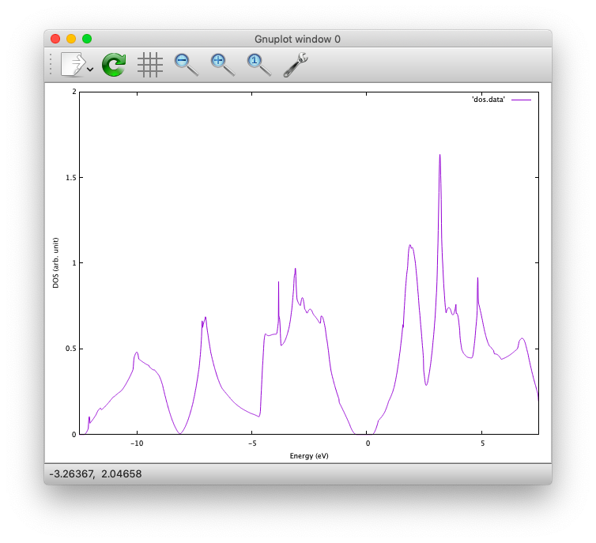

Cell optimization
-----------------
In the current version of STATE, the stress tensor is not (yet!) calculated, and the cell optimization should be performed manually.
Let us change the lattice constant from 10.20 Bohr to 10.50 Bohr by 0.05 Bohr by changing the input variable ``CELL``

.. code:: bash

  CELL   10.20  10.20  10.20  90.00  90.00  90.00

.. code:: bash

  CELL   10.25  10.25  10.25  90.00  90.00  90.00

...

.. code:: bash

  CELL   10.50  10.50  10.50  90.00  90.00  90.00

For each lattice constant we prepare an input file as ``nfinp_scf_10.20``, ``nfinp_scf_10.25``, ... ``nfinp_scf_10.50`` and submit jobs by changing the input and output files in the job script.

.. code:: bash

  $ sbatch run.sh

To collect the volume-energy (E-V) data, here we use ``state2ev.sh`` script in ``state-5.6.6/util/`` as

.. code:: bash

  $ state2ev.sh nfout_scf_* > etot.dat

This can be visualized by using, for example, ``gnuplot`` as

.. code:: bash

  $ gnuplot

.. code:: bash

  $ gnuplot> plot 'etot.dat' pt 7

The output looks like

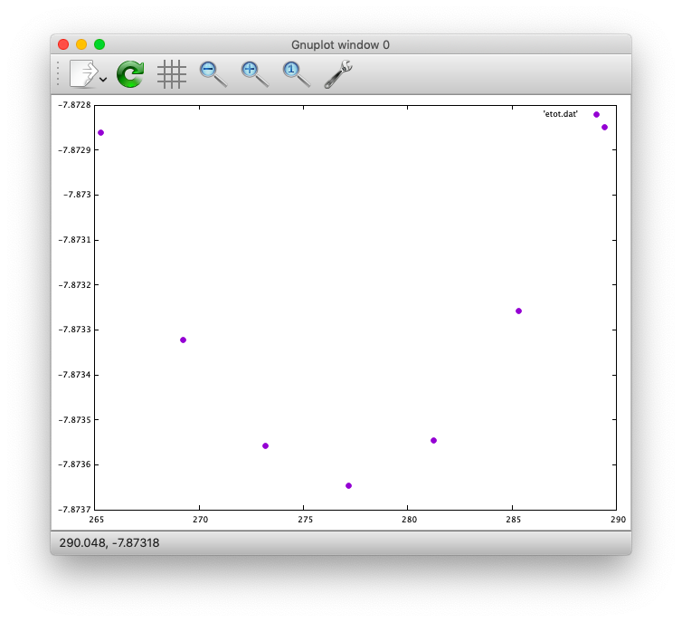

Furthermore, by using the ``eosfit`` in the ``util`` directory as

.. code:: bash

  $ eosfit etot.dat

one can see the following

.. image:: ../../../img/etot_si_fit.png
   :scale: 80%
   :align: center

and the equilibrium volume is obitained.

The equilibrium volume (v0), energy (e0), bulk modulus (b0), and derivative of bulk modulus (b0') can be found in ``eosfit.param``.
The resulting equilibrium lattice constant is 10.3455 Bohr.
Compare with that reported in the literature.

Aluminum
========
In this example, how to deal with a metallic system with the smearing method is briefly described by using the crystalline aluminium in the face centered cubic (fcc) structure.

SCF
---
In the ``Al`` directory, we use the following input file for the SCF calculation.

``nfinp_scf``::

  #
  # Crystalline aluminum in the face centered cubic structure
  #
  WF_OPT  DAV
  NTYP    1
  NATM    1
  TYPE    2
  NSPG    221
  GMAX    4.00
  GMAXP   8.00
  KPOINT_MESH   12  12  12
  KPOINT_SHIFT  OFF OFF OFF
  SMEARING MP
  WIDTH   0.0020
  EDELTA  0.5000D-09
  NEG     6
  CELL    7.50000000   7.50000000   7.50000000  90.00000000  90.00000000  90.00000000
  &ATOMIC_SPECIES
  Al 26.9815386 pot.Al_pbe1
  &END
  &ATOMIC_COORDINATES CRYSTAL
        0.000000000000      0.000000000000      0.000000000000    1    0    1
  &END

Here we set the smearing function of Methefessel and Paxton (MP) as

.. code:: bash

  SMEARING MP

and smearing width

.. code:: bash

  WIDTH  0.0020

We can also use negative ``WIDTH`` without specifying ``SMEARING`` to enable the smearing function.
In this case the MP smearing function is automatically set.
See the manual for the available smearing functions.

Submit the STATE job as

.. code:: bash

  $ sbatch run.sh

Total energy of the metallic system is sensitive to the smearing function and width, and the number of k-points, and they should be determined very carefully before the production run.
Detail is discussed in the tutorial (to be completed).

Nickel
======

This example shows how to perform a calculation of a spin-polarized system using the ferromagnetic Ni in the fcc structure.

The directory is ``Ni``.

SCF
---

* Input file (``nfinp_scf``)

.. code:: bash

  #
  # Ferromagnetic Ni in the fcc structure
  #
  WF_OPT DAV
  NTYP   1
  NATM   1
  TYPE   2
  NSPG   221
  GMAX    5.00
  GMAXP  15.00
  KPOINT_MESH   12  12  12
  KPOINT_SHIFT  OFF OFF OFF
  MIX_ALPHA 0.3
  SMEARING MP
  WIDTH  0.0020
  EDELTA 0.5000D-09
  NSPIN  2
  NBZTYP 102
  NEG    10
  CELL   6.70  6.70  6.70  90.00  90.00  90.00
  &ATOMIC_SPECIES
   Ni 58.6900 pot.Ni_pbe4
  &END
  &INITIAL_ZETA
   0.20 
  &END
  &ATOMIC_COORDINATES CRYSTAL
        0.000000000000      0.000000000000      0.000000000000    1    1    1
  &END

To allow the spin polarized calculation, one has to set

.. code:: bash

  NSPIN 2

along with the initial magnetization as

.. code:: bash

  &INITIAL_ZETA
   0.20
  &END

for each atomic species.

Submitting a job::

  $ sbatch run.sh

As above, ``dos.data`` is automatically generated. In the case of spin polarized system, the first column of ``dos.data`` contains energy, second and third columns contain DOS for spin up and down respectively.
This can be plotted by using gnuplot as follows:

.. code:: bash

  $ gnuplot

.. code:: bash

  $ gnuplot> set xrange [-10:5]
  $ gnuplot> set yrange [0:4]
  $ gnuplot> set xlabel 'E-E_F (eV)'
  $ gnuplot> set ylabel 'DOS (state/eV)'
  $ gnuplot> plot 'dos.data' using ($1):($2) w l title 'Spin-up','dos.data' using ($1):($3) w l title 'Spin-down'

The spin-polarized DOS looks like:

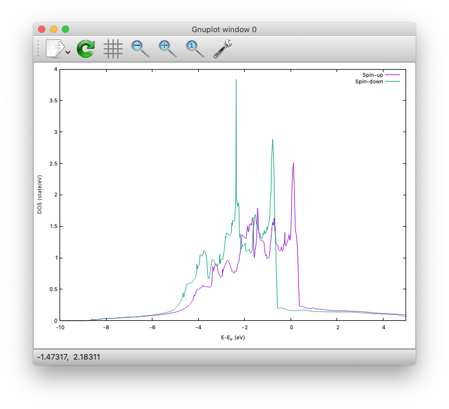

Or by using the following:

.. code:: bash

  $ gnuplot> set xrange [-10:5]
  $ gnuplot> set yrange [-4:4]
  $ gnuplot> set yzeroaxis
  $ gnuplot> set xlabel 'E-E_F (eV)'
  $ gnuplot> set ylabel 'DOS (state/eV)'
  $ gnuplot> plot 'dos.data' using ($1):($2) w l title 'Spin-up','dos.data' using ($1):(-$3) w l title 'Spin-down'

One may obtain the spin-polarized DOS like:

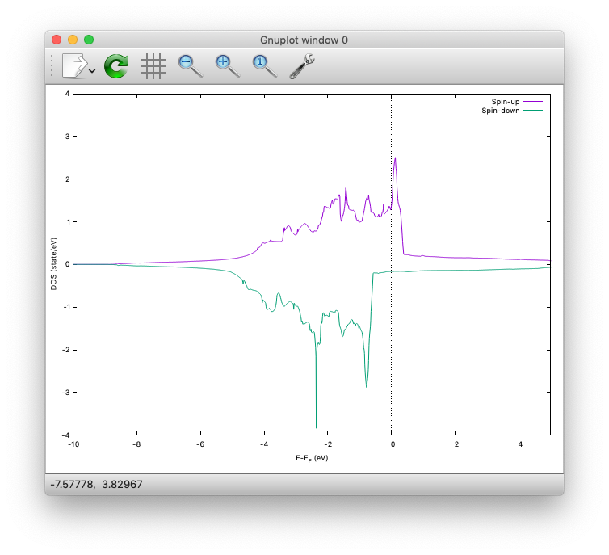

Ethylene
========

This example explains how to perform the geometry optimization.

* Directory ``C2H4``

* Input file ``nfinp_gdiis``

.. code:: bash

  #
  # Ethylene molecule in a box: geometry optimization with the GDIIS method
  #
  WF_OPT  DAV
  GEO_OPT GDIIS
  NTYP   2
  NATM   6
  TYPE   0
  GMAX    5.00
  GMAXP  15.00
  MIX_ALPHA 0.8
  WIDTH   0.0010
  EDELTA  0.1000D-08
  NEG     10
  FMAX    0.5000D-03
  CELL   12.00  12.00  12.00  90.00  90.00  90.00
  &ATOMIC_SPECIES
   C  12.0107  pot.C_pbe3
   H   1.0079  pot.H_lda3
  &END
  &ATOMIC_COORDINATES CARTESIAN
        1.262722983300      0.000000000000      0.000000000000    1    1    1
        2.348328846800      1.753458668500      0.000000000000    1    1    2
        2.348328846800     -1.753458668500      0.000000000000    1    1    2
       -1.262722983300      0.000000000000      0.000000000000    1    1    1
       -2.348328846800      1.753458668500      0.000000000000    1    1    2
       -2.348328846800     -1.753458668500      0.000000000000    1    1    2
  &END
 
The keyword ``GEO_OPT`` is used to activate the geometry optimization.
In this example, GDIIS algorithm is employed as::

  GEO_OPT GDIIS

The force threshold for the geometry optimization is set by the keyword ``FMAX`` as::

  FMAX    0.5000D-03

Geometry optimization
---------------------

.. code:: bash

  $ sbatch run_gdiis.sh

The convergence of the forces can be monitored by:

.. code:: bash

  $ grep -A1 f_max nfout_gdiis

The result looks like::

     NIT     TotalEnergy     f_max     f_rms      edel      vdel      fdel
       1    -13.90231646  0.001396  0.001303  0.13D-08  0.59D-07  0.13D-08
  --
     NIT     TotalEnergy     f_max     f_rms      edel      vdel      fdel
       2    -13.90232125  0.001296  0.001109  0.45D-09  0.47D-07  0.45D-09
  --
     NIT     TotalEnergy     f_max     f_rms      edel      vdel      fdel
       3    -13.90233075  0.000965  0.000788  0.27D-09  0.13D-06  0.27D-09
  --
     NIT     TotalEnergy     f_max     f_rms      edel      vdel      fdel
       4    -13.90234041  0.000562  0.000459  0.17D-08  0.25D-06  0.17D-08
  --
     NIT     TotalEnergy     f_max     f_rms      edel      vdel      fdel
       5    -13.90234848  0.000329  0.000271  0.11D-09  0.91D-07  0.11D-09

Final atomic coordinates in the cartesian coordinate and forces acting on atoms are given as::

                         CONVERGED ENERGY AND FORCES 
     NIT     TotalEnergy     f_max     f_rms      edel      vdel      fdel
       5    -13.90234843  0.000349  0.000281  0.25D-09  0.12D-06  0.25D-09
  
      ATOM              COORDINATES                        FORCES
  MD:    5
  MD:    1  C   1.260786   0.000001  -0.000000  -0.00035 -0.00000  0.00000
  MD:    2  H   2.337963   1.755204  -0.000000  -0.00019 -0.00015  0.00000
  MD:    3  H   2.337964  -1.755205  -0.000000  -0.00019  0.00015  0.00000
  MD:    4  C  -1.260786   0.000000  -0.000000   0.00035 -0.00000  0.00000
  MD:    5  H  -2.337963   1.755204   0.000000   0.00019 -0.00015 -0.00000
  MD:    6  H  -2.337963  -1.755204   0.000000   0.00019  0.00015 -0.00000
  
   EXITING ATOM LOOP 

Because the maximum force ``f_max`` is smaller than the threshold, the calculation stops with the message::

   EXITING ATOM LOOP 

The latest geometry is stored in the ``GEOMETRY`` file, and in the case of GDIIS, past geometries are stored in ``gdiis.data``.
It is suggested that ``gdiis.data`` be deleted or renamed when the number of optimization steps is close to the number of degrees of freedom.

If the structural optimization is not finished, add the keyword ``RESTART`` in the input file and submit the job again. To restart the calculation, make sure ``restart.data`` file exists in the working directory.

Vibrational analyis
-------------------

Having obtained the optimized geometry, let us perform the vibrational (normal) mode analysis.
This can be done in the following steps.

Frist, we need to create an input file with the optimized geometry.
This can be done by using a utility ``geom2nfinp`` as

.. code:: bash

  $ geom2nfinp -i nfinp_gdiis -g GEOMETRY -o nfinp_relaxed

where input parameters from ``nfinp_gdiis`` and atomic positions from ``GEOMETRY`` are used to create a new input file ``nfinp_relaxed``. 
``geom2nfinp`` can also be used to generate an XYZ/XSF file from the optimized geometry.
Type ``geom2nfinp -h`` for the usage of the command.

Then we copy ``nfinp_relaxed`` to ``nfinp_vib`` which looks like::

  #
  # Ethylene molecule in a box: geometry optimization with the GDIIS method
  #
  TASK   VIB
  WF_OPT DAV
  NTYP   2
  NATM   6
  TYPE   0
  GMAX    5.00
  GMAXP  15.00
  MIX_ALPHA 0.8
  WIDTH   0.0010
  EDELTA  0.1000D-08
  NEG     10
  FMAX    0.5000D-03
  CELL   12.00  12.00  12.00  90.00  90.00  90.00
  &ATOMIC_SPECIES
   C  12.0107  pot.C_pbe3
   H   1.0079  pot.H_lda3
  &END
  &ATOMIC_COORDINATES CARTESIAN
        1.260767348060     -0.000000889176      0.000000061206    1    1    1
        2.337934105040      1.755199776368      0.000000035554    1    1    2
        2.337933682371     -1.755198581491      0.000000037135    1    1    2
       -1.260766004354     -0.000000071340      0.000000050715    1    1    1
       -2.337933757669      1.755199342527      0.000000064907    1    1    2
       -2.337933482763     -1.755199042963      0.000000067944    1    1    2
  &END

We can see the new keyword ``TASK VIB``, which enables one to perform the vibrational analysis.

.. note::

  Make sure the atomic masses in the input file are those you want to use as
  in some cases we use artificially large/small atomic masses for efficient structural optimization.

In addition to the input file, we need prepare ``nfvibrate.data`` as::

      1  0.10D+01   1
       1   0.0100000000   0.0000000000   0.0000000000
      1 -0.10D+01   1
       1   0.0100000000   0.0000000000   0.0000000000
      1  0.10D+01   2
       1   0.0000000000   0.0100000000   0.0000000000
      1 -0.10D+01   2
       1   0.0000000000   0.0100000000   0.0000000000
      1  0.10D+01   3
       1   0.0000000000   0.0000000000   0.0100000000
      1 -0.10D+01   3
       1   0.0000000000   0.0000000000   0.0100000000
      ...
      1  0.10D+01  16
       6   0.0100000000   0.0000000000   0.0000000000
      1 -0.10D+01  16
       6   0.0100000000   0.0000000000   0.0000000000
      1  0.10D+01  17
       6   0.0000000000   0.0100000000   0.0000000000
      1 -0.10D+01  17
       6   0.0000000000   0.0100000000   0.0000000000
      1  0.10D+01  18
       6   0.0000000000   0.0000000000   0.0100000000
      1 -0.10D+01  18
       6   0.0000000000   0.0000000000   0.0100000000

In the present example, the file contains 2 x 2 x 6 x 3 = 72 lines, which define the atomic displacement in the cartesian coordinate.
This is 36 set of displacement composed of 2 lines (in this case).
Here I use first two lines as an example:

First line

.. code:: bash

      1  0.10D+01   1

* First column : number of displacement(s)

* Second column : factor for the displacement

* Thrid column : dummy

Second line

.. code:: bash

       1   0.0100000000   0.0000000000   0.0000000000

* First column in the second line: the index for the atom displaced

* Second-Fourth column in the second line: atomic displacement in the cartesian coordinate.

Actual atomic displacements are atomic displacement (2-4th column in the second line multiplied by the factor).

Submit the job

.. code:: bash

  $ sbatch run_vib.sh

and we get ``nfforce.data`` in addition to the standard output files, which contains displaced atomic positions and forces acting on atoms, which can be used to calculate the vibrational frequencies.

Then to calculate the dynamical matrix and vibrational frequencies, we use the ``gif`` program as follows:

.. code:: bash

  $ gif -f nfforce.data

and we can see the vibrational frequncies printed in the standard output as:

.. code:: bash

               =========             
                SUMMARY              
               =========             
  
   MODE  WR       : NU(meV)  NU(cm-1)
      1 -0.42D-03 :   12.97    104.63
      2 -0.19D-03 :    8.76     70.63
      3 -0.61D-04 :    4.97     40.06
      4 -0.18D-04 :    2.67     21.50
      5  0.30D-04 :    3.46     27.93
      6  0.28D-03 :   10.71     86.35
      7  0.25D-01 :  100.48    810.43
      8  0.32D-01 :  114.17    920.88
      9  0.34D-01 :  116.25    937.60
     10  0.41D-01 :  128.26   1034.48
     11  0.55D-01 :  148.39   1196.82
     12  0.68D-01 :  165.42   1334.18
     13  0.76D-01 :  175.51   1415.54
     14  0.10D+00 :  201.49   1625.12
     15  0.36D+00 :  379.55   3061.29
     16  0.36D+00 :  381.80   3079.41
     17  0.37D+00 :  388.22   3131.17
     18  0.38D+00 :  393.55   3174.18

The first column, the number of mode, the second column, square of the vibrational frequency in Hartree, and third and fourth columns are vibrational frequencies in meV and wavenumber (cm^-1), respectively.

.. warning::
	New data are always appended to the exsiting ``nfforce.data``. Rename it when (a set of) calculations are finished.

Finally, we visualize the vibrational mode by using the ``gif2xsf`` utility.
To use ``gif2xsf`` we prepare an XSF, which can be created by using the ``chkinpf`` utility as:

.. code:: bash

  $ chkinpf --atom nfinp_vib

By this we are able to create an XSF file for molecule (not periodic boundary condition).
Then type

.. code:: bash

  $ gif2xsf -s --xsf C2H4 --gif vib.data --prefix vib

Use C2H4.xsf for the XSF file, vib.data for VIB file, and vib for prefix, and we get separate vib_*.xsf, which can be visualized by using XCrySden or VESTA.

Finite temperature molecular dynamics
-------------------------------------
In this example, we are going to perform a finite temperature molecular dynamics simulation.

* Input file ``nfinp_nhc``

.. code:: bash

  #
  # Ethylene molecule in a box: finite temperature molecular dynamics
  #
  WF_OPT  DAV
  ION_DYN FTMD
  NTYP   2
  NATM   6
  TYPE   0
  GMAX    5.00
  GMAXP  15.00
  MIX_ALPHA 0.8
  WIDTH   0.0010
  EDELTA  0.1000D-08
  NEG     10
  TEMP_CONTROL NHC
  TEMPW   300.0D0
  WNOSEP  500.0D0
  NHC     8
  NOSY    15
  NDRT    1
  CELL   12.00  12.00  12.00  90.00  90.00  90.00
  &ATOMIC_SPECIES
   C  12.0107  pot.C_pbe3
   H   1.0079  pot.H_lda3
  &END
  &ATOMIC_COORDINATES CARTESIAN
        1.262722983300      0.000000000000      0.000000000000    1 1001    1
        2.348328846800      1.753458668500      0.000000000000    1 1001    2
        2.348328846800     -1.753458668500      0.000000000000    1 1001    2
       -1.262722983300      0.000000000000      0.000000000000    1 1001    1
       -2.348328846800      1.753458668500      0.000000000000    1 1001    2
       -2.348328846800     -1.753458668500      0.000000000000    1 1001    2
  &END

To perform a molecular dynamics simulation, we set ``ION_DYN`` ``FTMD`` and how to control the temperature is given as::

  TEMP_CONTROL NHC
  TEMPW   300.0D0
  WNOSEP  500.0D0
  NHC     8
  NOSY    15
  NDRT    1

Submit the job

.. code:: bash

  $ sbatch run_ftmd.sh

In this example, we perform 200 MD steps (default value).
When the calculation is terminated, we get ``TRAJECTORY`` containing the trajectory and ``ENERGIES`` containing information on temperature and energies.

To visualize the trajectroy, first we need ``GEOMETRY.xyz``, which can be generated by

.. code:: bash

  $ chkinpf --xyz nfinp_nhc -o GEOMETRY.xyz

Then use ``traj2xyz.pl`` in the current example directry as

.. code:: bash

  $ ./traj2xyz.pl > traj.xyz

to save the trajectory in the XYZ format.

Use XCrySDen, VMD, or other your favorite visualization software to visualize it (VESTA cannot be used for movies).

.. note::
  Generally, long time molecular dynamics simulation is required to obtain reliable statistical ensemble/average, which cannot be possible within the given hours. In STATE, use ``CPUMAX`` to dump the latest geometry and wave functions before the time limit, and restart by using the ``RESTART`` keyword. It is also possible to terminate the job by writing a positive number in the ``nfstop.data``.

Cl on Al(100)
=============

This example explains how to model the surface with an adsobate by using an Al(100) surface with a Cl atom.
We also discuss how the periodic boundary condition (PBC) affects the potential (and thus the energy and forces)
and how to address the issue by using the effective screening medium (ESM) method.

Geometry optimization with PBC
------------------------------

Go to ``ClonAl100`` and use the following input file (``nfinp_gdiis_pbc``)::

  #
  # Cl on Al(100)
  #
  WF_OPT  DAV
  GEO_OPT GDIIS
  NTYP    2
  NATM    7
  NSPG    1
  GMAX    4.00
  GMAXP  10.00
  KPOINT_MESH    4   4   1
  KPOINT_SHIFT   ON  ON  OFF
  SMEARING  MP
  WIDTH     0.0020
  NEG       16
  MIX       BROYDEN2
  MIX_ALPHA 0.80
  EDELTA   1.000D-09
  DTIO     600.00
  FMAX     1.000D-03
  &ATOMIC_SPECIES
   Al  26.9815 pot.Al_pbe1
   Cl  35.4527 pot.Cl_pbe1
  &END
  &CELL
        7.653400000000      0.000000000000      0.000000000000
        0.000000000000      7.653000000000      0.000000000000
        0.000000000000      0.000000000000     30.613600000000
  &END
  &ATOMIC_COORDINATES CARTESIAN
        0.000000000000      0.000000000000      3.700000000000    1    1    2
        0.000000000000      3.826700000000      0.000000000000    1    1    1
        3.826700000000      0.000000000000      0.000000000000    1    1    1
        0.000000000000      0.000000000000     -3.826700000000    1    0    1
        3.826700000000      3.826700000000     -3.826700000000    1    0    1
        0.000000000000      3.826700000000     -7.653400000000    1    0    1
        3.826700000000      0.000000000000     -7.653400000000    1    0    1
  &END

We see that how to define the lattice vectors differs from the previous examples.

Subit the STATE job by executing:

.. code:: bash

  $ sbatch run.sh

and we get ``GEOMETRY`` and ``gdiis.data`` in addition to the standard output files.

.. warning::
	When the geometry optimization is performed with the GDIIS method from scratch, make sure that there is no existing ``gdiis.dta``. Furthermore, when the number of optimization steps exceeds the number of degrees of freedom, delete or rename ``gdiis.data``.

Geometry optimization with the ESM method
-----------------------------------------

We then use ``nfinp_gdiis_esm`` for the structural optimization with the effective screening medium method, which looks like::

  #
  # Cl on Al(100)
  #
  WF_OPT  DAV
  GEO_OPT GDIIS
  NTYP    2
  NATM    7
  NSPG    1
  GMAX    4.00
  GMAXP  10.00
  KPOINT_MESH    4   4   1
  KPOINT_SHIFT   ON  ON  OFF
  SMEARING  MP
  WIDTH     0.0020
  NEG       16
  MIX       BROYDEN2
  MIX_ALPHA 0.80
  EDELTA   1.000D-09
  DTIO     600.00
  FMAX     1.000D-03
  &ESM
   BOUNDARY_CONDITION BARE
  &END
  &ATOMIC_SPECIES
   Al  26.9815 pot.Al_pbe1
   Cl  35.4527 pot.Cl_pbe1
  &END
  &CELL
        7.653400000000      0.000000000000      0.000000000000
        0.000000000000      7.653000000000      0.000000000000
        0.000000000000      0.000000000000     30.613600000000
  &END
  &ATOMIC_COORDINATES CARTESIAN
        0.000000000000      0.000000000000      3.700000000000    1    1    2
        0.000000000000      3.826700000000      0.000000000000    1    1    1
        3.826700000000      0.000000000000      0.000000000000    1    1    1
        0.000000000000      0.000000000000     -3.826700000000    1    0    1
        3.826700000000      3.826700000000     -3.826700000000    1    0    1
        0.000000000000      3.826700000000     -7.653400000000    1    0    1
        3.826700000000      0.000000000000     -7.653400000000    1    0    1
  &END

Diffence from the previous calculation is ::

  &ESM
   BOUNDARY_CONDITION BARE
  &END

This enables the ESM calculation. 
In this case open boundary condition in the surface normal direction is used.

Analysis of the effective and electrostatic potentials
------------------------------------------------------

Here we analyze the potentials from PBC and ESM calculations.
Use ``state2chgpro.sh`` utility to extract planar average of charge, effective (Kohn-Sham) and electrostatic potentials as:

.. code:: bash

  $ state2chgpro.sh nfout_gdiis_pbc > chgpro.dat_pbc

``chgpro.dat_pbc`` may look like following:

.. code::

  #
  # Fermi energy =       -0.05368332 Hartree
  #
  #          z           Charge             VlHxc               VlH
       0.0000      0.0244720791     -0.5159539900     -0.1911502410
       0.3061      0.0234616356     -0.5090777191     -0.1881052797
       0.6123      0.0227510319     -0.4956732447     -0.1748120165
       0.9184      0.0226562465     -0.4739551828     -0.1543648253
       ...

Here, the first column is the z-coordinate in the Bohr radius, and second, third, and fourth column are the planer averages of charge density, local potential (sum of local pseudo-, Hartree, and XC potentials), and hartree potential, respectively. 

By plotting the first (z-coordinate) and third (local potential) colums, and first (z-coordinate) and fourth (electrostatic potential) colums, we get the following potential profile:

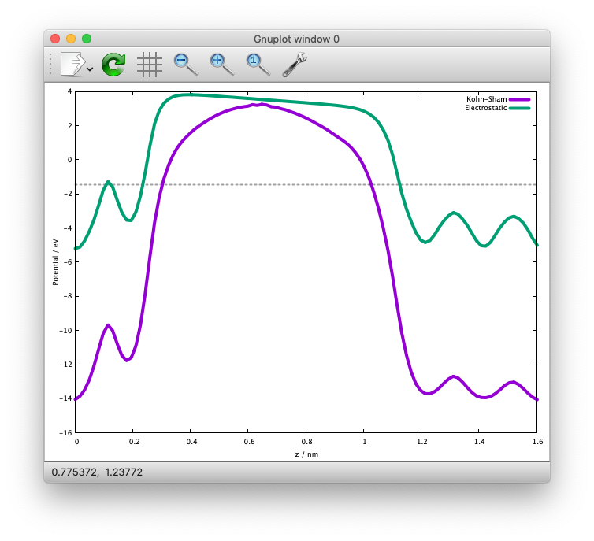

We can see that the electric field is applied to the slab because of the periodic boundary condition.

We also extract the planar average of chargen and potential from the ESM calculations as:

.. code:: bash

  $ state2chgpro.sh nfout_gdiis_esm > chgpro.dat_esm

and we get the following:

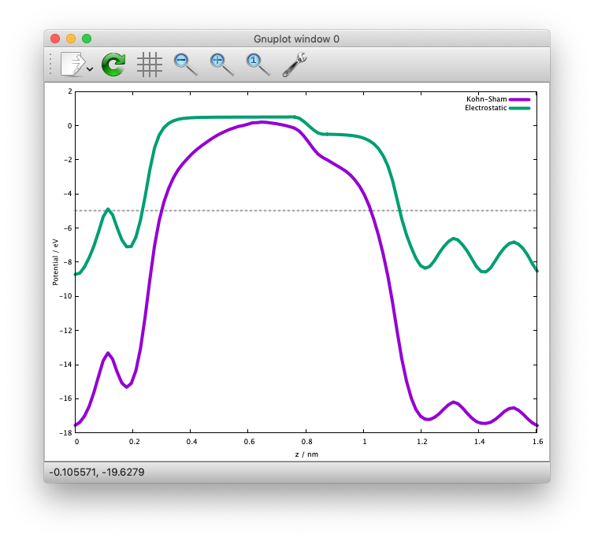

We can see that the potentials are flat in the vacuum region. Mind that the slab is locased near the origin (z=0). The discontinuity is by the plotting reason (actually they are disconnected because we do not use the periodic boundary condition with the ESM method). 

Graphene
========

In this example (``GR``), how to optimize the cell parameter, how to calculate the band structure, and how to calculate density of states, are described.

* Sample input file ``nfinp_scf``

.. code:: bash

  WF_OPT    DAV
  NTYP      1
  NATM      2
  TYPE      0
  #NSPG     1017
  GMAX      5.00
  GMAXP    15.00
  KPOINT_MESH   12  12  1
  KPOINT_SHIFT  F   F   F
  NSCF      400
  WAY_MIX   3
  MIX_ALPHA 0.4
  SMEARING  MP
  WIDTH     0.0010
  EDELTA    0.1000D-11
  NEG       24
  CELL      4.6591  4.6591 18.89726878  90.00  90.00 120.00
  &ATOMIC_SPECIES
   C  12.0107 pot.C_pbe3
  &END
  &ATOMIC_COORDINATES CRYSTAL
        0.00000000000      0.00000000000      0.00000000000    1    1    1
        0.33333333333      0.66666666667      0.00000000000    1    1    1
  &END

Cell optimization
-----------------

Go to the subdirectory ``Opt/`` and as in the example of silicon, we manually change the in-plane lattice parameter (a and b) by 0.02 Bohr as

.. code:: bash

  CELL      4.54 4.54 18.89726878  90.00  90.00 120.00

.. code:: bash

  CELL      4.56 4.56 18.89726878  90.00  90.00 120.00

...

.. code:: bash

  CELL      4.74 4.74 18.89726878  90.00  90.00 120.00

For each lattice constant we prepare an input file as ``nfinp_scf_a4.54``, ``nfinp_scf_a4.56``, ... ``nfinp_scf_4.74`` and execute STATE (min. and max. values, as well as the interval are arbitrary) by

.. code:: bash

  $ sbatch run.sh

Alternatively one can use ``run_opt.sh`` to automatically run a set of calculations.
 

We then plot the total energy as a function of lattice parameter (use getetot.sh in the same directory), and fit it to any function. In this example, let us use 6th order polynomial. The result looks like:

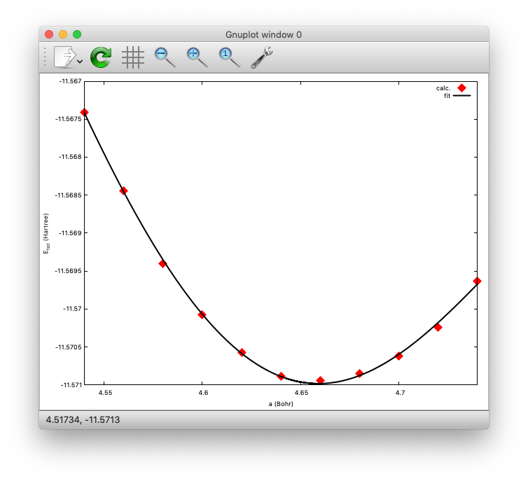

The minimum (equilibrium) can be found at a=4.6591 (Bohr). Compare with the experimental value.

Band structure calculation
--------------------------

We then use the theoretically optimized lattice parameter to calculate the band structure of graphene.
Change directory to ``Band/`` and the files ``nfinp_scf`` and ``nfinp_band`` can be found.

To calculate the band structure, first we perform an SCF calculation to obtain a converged charge density (or potential) and perform a fixed charge (potential) non-SCF calculation for the high-symmetry k-points.

First perform the SCF calculation by using the following input file (``nfinp_scf``)::

  WF_OPT    DAV
  NTYP      1
  NATM      2
  TYPE      0
  #NSPG     1017
  GMAX      5.00
  GMAXP    15.00
  KPOINT_MESH   12  12  1
  KPOINT_SHIFT  F   F   F
  NSCF      400
  WAY_MIX   3
  MIX_ALPHA 0.4
  SMEARING  MP
  WIDTH     0.0010
  EDELTA    0.1000D-11
  NEG       24
  CELL      4.6591  4.6591 18.89726878  90.00  90.00 120.00
  &ATOMIC_SPECIES
   C  12.0107 pot.C_pbe3
  &END
  &ATOMIC_COORDINATES CRYSTAL
        0.00000000000      0.00000000000      0.00000000000    1    1    1
        0.33333333333      0.66666666667      0.00000000000    1    1    1
  &END

.. code:: bash

  $ sbatch run.sh

After converging the charge/potential, we perform the non-SCF band structure calculation by using the following input (``nfinp_band``)::

  TASK      BAND
  WF_OPT    DAV
  NTYP      1
  NATM      2
  TYPE      0
  #NSPG     1017
  GMAX      5.00
  GMAXP    15.00
  KPOINT_MESH   12  12  1
  KPOINT_SHIFT  F   F   F
  NSCF      400
  WAY_MIX   3
  MIX_WHAT  1
  KBXMIX    20
  MIX_ALPHA 0.4
  SMEARING  MP
  WIDTH     0.0010
  EDELTA    0.1000D-11
  NEG       24
  CELL      4.6591  4.6591 18.89726878  90.00  90.00 120.00
  &ATOMIC_SPECIES
   C  12.0107 pot.C_pbe3
  &END
  &ATOMIC_COORDINATES CRYSTAL
        0.00000000000      0.00000000000      0.00000000000    1    1    1
        0.33333333333      0.66666666667      0.00000000000    1    1    1
  &END
  &KPOINTS_BAND
   NKSEG 3
   KMESH 20 20 20
   KPOINTS 
   0.00000000  0.00000000  0.00000000
   0.66666667 -0.33333333  0.00000000
   0.50000000  0.00000000  0.00000000
   0.00000000  0.00000000  0.00000000
  &END

For the band structure calculation, we use the following keyword::

  TASK      BAND

To specify the high symmetry k-points, we add the following::

  &KPOINTS_BAND
   NKSEG 3
   KMESH 20 20 20
   KPOINTS 
   0.00000000  0.00000000  0.00000000
   0.66666667 -0.33333333  0.00000000
   0.50000000  0.00000000  0.00000000
   0.00000000  0.00000000  0.00000000
  &END

Here we define the number of k-point segments by the keyword ``NKSEG``::

   NKSEG 3

k-point mesh for each segment::

   KMESH 20 20 20

and NKSEG+1 k-points defining each segments::

   KPOINTS 
   0.00000000  0.00000000  0.00000000
   0.66666667 -0.33333333  0.00000000
   0.50000000  0.00000000  0.00000000
   0.00000000  0.00000000  0.00000000

Here the k-points are given in the unit of the reciprocal lattice vectors.
To give the k-points in the cartesian coordinate, use:: 

   KPOINTS CARTESIAN

Run the band structure calculation by replacing the input file with ``nfinp_band`` in ``run.sh``

.. code:: bash

  $ sbatch run.sh

we obtain the file ``energy.data``, which containg the Kohn-Sham eigenvalues, along with the k-points.
However, we cannot plot the band structure directory from ``energy.data`` and should be processed properly.
To convert the ``energy.data`` file into a plottable XY data, we use the ``energy2band`` program.
Type

.. code:: bash

  $ energy2band

and you will be asked the numbers of bands considered, the number of bands to be plotted (can be the same as the previous one), the number of k-points considered (in this example, the eigenvalues at 61 k-points are calculated), and the energy origin (here, the Fermi level obtained in the SCF calculation will be used).
If the numbers are given properly, we obtain the file ``band.data``, which can be used to plot the band directory by using gnuplot or grace.

Here is how the band structure looks like:

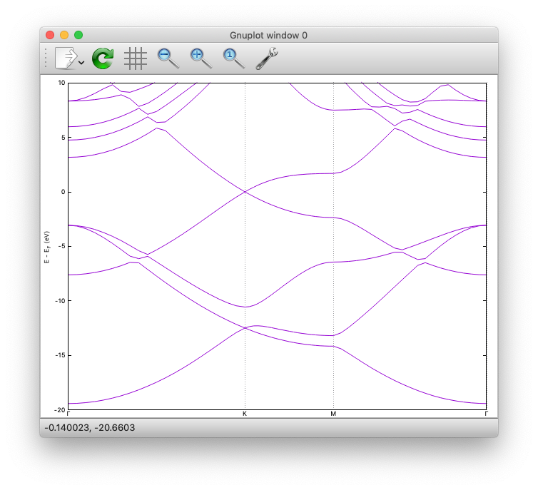

Density of states
-----------------

Now let us calculate the density of states (DOS) and projected DOS (PDOS) onto the atomic orbital.

Change the directory to ``DOS/`` and we can find the directories ``12x12/``, ``16x16/``, and ``24x24/``, which indicate the k-point mesh used the calculation.

Let us change directory to ``12x12`` and have a look at the input file::

  WF_OPT    DAV
  NTYP      1
  NATM      2
  TYPE      0
  #NSPG     1017
  GMAX      5.00
  GMAXP    15.00
  KPOINT_MESH   12  12  1
  KPOINT_SHIFT  F   F   F
  NSCF      400
  WAY_MIX   3
  MIX_WHAT  1
  KBXMIX    20
  MIX_ALPHA 0.4
  SMEARING  MP
  WIDTH     0.0010
  EDELTA    0.1000D-11
  NEG       24
  CELL      4.6591  4.6591 18.89726878  90.00  90.00 120.00
  &ATOMIC_SPECIES
   C  12.0107 pot.C_pbe3
  &END
  &ATOMIC_COORDINATES CRYSTAL
        0.00000000000      0.00000000000      0.00000000000    1    1    1
        0.33333333333      0.66666666667      0.00000000000    1    1    1
  &END
  &DOS
   EMIN -20.0
   EMAX  10.0
  &END

The total density of states is printed to ``dos.data``, and the default energy window is from -0.5  to + 0.3 Hartree (-13.6057 to 8.1634 eV relative to the Fermi level).
To change the energy windown, we use the ``&DOS...&END`` block as::

  &DOS
   EMIN -20.0
   EMAX  10.0
  &END

where minimum and maximum energies are given in eV.

By Running the SCF calculation in each directory, we can observe the convergence of the density of states:

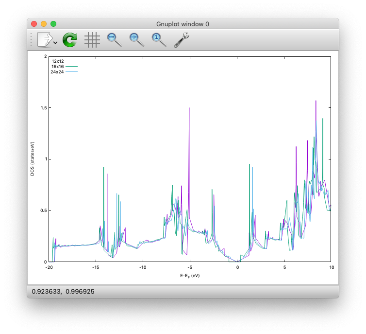

Finally, in the ``DOS/24x24`` directory, we calculate PDOS.
The PDOS can be calculated at the end of the SCF calculation, or as a postprocess.
To compute PDOS in the SCF calculation, we can use the following ``nfinp_scf+pdos``::

  WF_OPT    DAV
  NTYP      1
  NATM      2
  TYPE      0
  #NSPG     1017
  GMAX      5.00
  GMAXP    15.00
  KPOINT_MESH   24  24  1
  KPOINT_SHIFT  F   F   F
  NSCF      400
  WAY_MIX   3
  MIX_WHAT  1
  KBXMIX    20
  MIX_ALPHA 0.4
  SMEARING  MP
  WIDTH     0.0010
  EDELTA    0.1000D-11
  NEG       24
  CELL      4.6591  4.6591 18.89726878  90.00  90.00 120.00
  &ATOMIC_SPECIES
   C  12.0107 pot.C_pbe3
  &END
  &ATOMIC_COORDINATES CRYSTAL
        0.00000000000      0.00000000000      0.00000000000    1    1    1
        0.33333333333      0.66666666667      0.00000000000    1    1    1
  &END
  &PDOS
   NPDOSAO 1
   IPDOST  1
   EMIN    -20.00
   EMAX     10.00
   EWIDTH    0.10
   NPDOSE  3001
   RCUT    1.30
   RWIDTH  0.10 
  &END

where the block ``&PDOS...&END`` is added to set the parameters for the PDOS calculation::
  
  &PDOS
   NPDOSAO 1
   IPDOST  1
   EMIN    -20.00
   EMAX     10.00
   EWIDTH    0.10
   NPDOSE  3001
   RCUT    1.30
   RWIDTH  0.10 
  &END

For the post-processing PDOS calculation, the following file (``nfinp_pdos``) can be used ::

  TASK      PDOS
  WF_OPT    DAV
  NTYP      1
  NATM      2
  TYPE      0
  #NSPG     1017
  GMAX      5.00
  GMAXP    15.00
  KPOINT_MESH   24  24  1
  KPOINT_SHIFT  F   F   F
  NSCF      400
  WAY_MIX   3
  MIX_WHAT  1
  KBXMIX    20
  MIX_ALPHA 0.4
  SMEARING  MP
  WIDTH     0.0010
  EDELTA    0.1000D-11
  NEG       24
  CELL      4.6591  4.6591 18.89726878  90.00  90.00 120.00
  &ATOMIC_SPECIES
   C  12.0107 pot.C_pbe3
  &END
  &ATOMIC_COORDINATES CRYSTAL
        0.00000000000      0.00000000000      0.00000000000    1    1    1
        0.33333333333      0.66666666667      0.00000000000    1    1    1
  &END
  &PDOS
   NPDOSAO 1
   IPDOST  1
   EMIN    -20.00
   EMAX     10.00
   EWIDTH    0.10
   NPDOSE  3001
   RCUT    1.30
   RWIDTH  0.10 
  &END

where the keyword ``TASK`` is used to perfom the PDOS calculation::

  TASK      PDOS

In the ``&PDOS...&END`` block, number of atoms for which PDOSs are computed is defined by::

   NPDOSAO 1

and corresponding atomic indices::

   IPDOST  1

Number of ``IPDOST`` should equal to ``NPDOSAO``.
Minimum and maximum energies (in eV) and number of grid points for the energy are defined by::

   EMIN    -20.00
   EMAX     10.00
   NPDOSE  3001

and the smearing width (in eV) for the gaussian is defined by::

   EWIDTH    0.10

We cutoff the atomic orbitals at certain radius ``RCUT`` (in Bohr)::

   RCUT    1.30

and the truncated orbital is smoothened by using the Fermi-Dirac type function with the width of ``RWIDTH``::

   RWIDTH  0.10 

The number of ``RCUT`` and ``RWIDTH`` should corresponds to the number of atomic species (``NTYPE``).

The calculated PDOS for graphene can be visualized as:

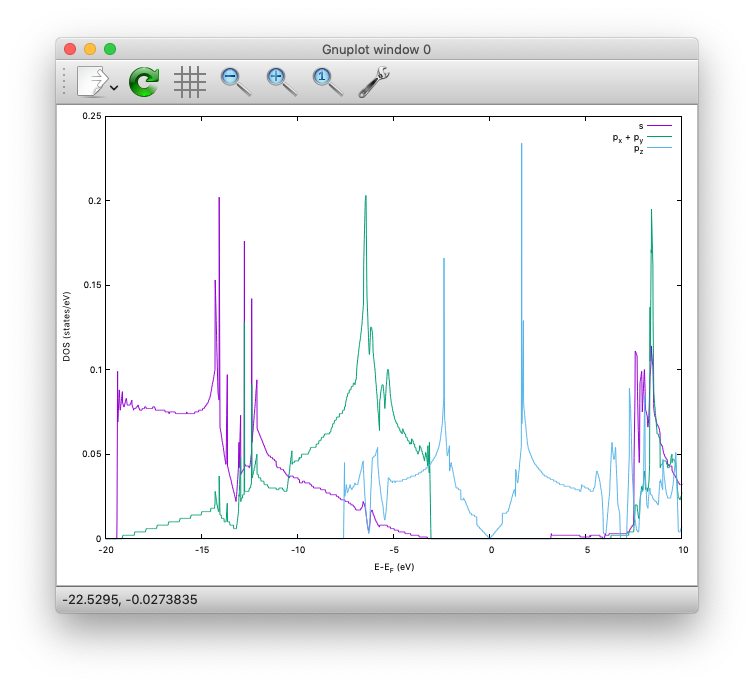

Benzene
=======

This example explain how to plot the molecular orbitals by using the benzene (C6H6) molecule.
The directory is ``C6H6/``

SCF
---

Let us start with the SCF calculation by using the following input ``nfinp_scf``::

  WF_OPT DAV
  NTYP   2
  NATM   12
  TYPE   0
  GMAX    5.00
  GMAXP  15.00
  MIX_ALPHA 0.8
  WIDTH   0.0010
  EDELTA  0.1000D-08
  NEG     24
  CELL   15.00  15.00  15.00  90.00  90.00  90.00
  &ATOMIC_SPECIES
   C  12.0107  pot.C_pbe3
   H   1.0079  pot.H_lda3
  &END
  &ATOMIC_COORDINATES XYZ
  12
  benzene example from https://openbabel.org/wiki/XYZ_(format)
    C        0.00000        1.40272        0.00000
    H        0.00000        2.49029        0.00000
    C       -1.21479        0.70136        0.00000
    H       -2.15666        1.24515        0.00000
    C       -1.21479       -0.70136        0.00000
    H       -2.15666       -1.24515        0.00000
    C        0.00000       -1.40272        0.00000
    H        0.00000       -2.49029        0.00000
    C        1.21479       -0.70136        0.00000
    H        2.15666       -1.24515        0.00000
    C        1.21479        0.70136        0.00000
    H        2.15666        1.24515        0.00000
  &END
  
Here we show that the XYZ format can be used to give the atomic coordinates.

After the SCF is converged, wave functions in real space can be calculated by using ``nfinp_prtwfc``::

  TASK   PRTWFC
  WF_OPT DAV
  NTYP   2
  NATM   12
  TYPE   0
  GMAX    5.00
  GMAXP  15.00
  MIX_ALPHA 0.8
  WIDTH   0.0010
  EDELTA  0.1000D-08
  NEG     24
  CELL   15.00  15.00  15.00  90.00  90.00  90.00
  &ATOMIC_SPECIES
   C  12.0107  pot.C_pbe3
   H   1.0079  pot.H_lda3
  &END
  &ATOMIC_COORDINATES XYZ
  12
  benzene example from https://openbabel.org/wiki/XYZ_(format)
    C        0.00000        1.40272        0.00000
    H        0.00000        2.49029        0.00000
    C       -1.21479        0.70136        0.00000
    H       -2.15666        1.24515        0.00000
    C       -1.21479       -0.70136        0.00000
    H       -2.15666       -1.24515        0.00000
    C        0.00000       -1.40272        0.00000
    H        0.00000       -2.49029        0.00000
    C        1.21479       -0.70136        0.00000
    H        2.15666       -1.24515        0.00000
    C        1.21479        0.70136        0.00000
    H        2.15666        1.24515        0.00000
  &END
  &PLOT
   IKPT 1
   IBS  14  
   IBE  17
   FORMAT XSF
  &END

Wave function plot can be activated by setting::

  TASK   PRTWFC

and the k-points and range of bands of the wave functions to be plotted is given by the block::

  &PLOT
   IKPT 1
   IBS  14  
   IBE  17
   FORMAT XSF
  &END

where ``IKPT`` is the index of the k-points, ``IBS`` and ``IBE`` are the indices of initial and final bands, respectively, and ``FORMAT`` is to specify the format of the output wave functions.
In this example, following files may be created::

  nfwfn_kpt0001_band0014_re.xsf
  nfwfn_kpt0001_band0014_im.xsf
  nfwfn_kpt0001_band0015_re.xsf
  nfwfn_kpt0001_band0015_im.xsf
  nfwfn_kpt0001_band0016_re.xsf
  nfwfn_kpt0001_band0016_im.xsf
  nfwfn_kpt0001_band0017_re.xsf
  nfwfn_kpt0001_band0017_im.xsf

Real part (\*_re\*) and image part (\*_im\*) of the wave functions are generated separately.
These wave functions can be plotted by using XCrySDen, VESTA, VMD, or alike.
The real parts of the doubly degenerated highest occupied molecular orbitals (HOMOs) are visualized and shown below:

TiO2
====

This example explains hot to perform a calculation with the on-site Coulomb potential correction (DFT+U) by using rutile.

SCF
---

* Directory ``TiO2/``

* Input file for the DFT calculation ``nfinp_scf``

.. code:: bash

  WF_OPT DAV
  NTYP 2
  NATM 6
  TYPE 0
  NSPG 136
  GMAX    5.00
  GMAXP  15.00
  KPOINT_MESH    6  6  8
  KPOINT_SHIFT   T  T  T
  NSCF    200
  KBXMIX 10
  MIX_ALPHA 0.1
  WIDTH   0.0002
  EDELTA  0.1000D-09
  NEG    30
  CELL    8.68080000   8.68080000   5.58940000  90.00000000  90.00000000  90.00000000
  XCTYPE  ldapw91
  &ATOMIC_SPECIES
   Ti  47.947900 pot.Ti_pbe3
   O   15.994900 pot.O_pbe3
  &END
  &ATOMIC_COORDINATES CRYSTAL
        0.000000000000      0.000000000000      0.000000000000    1    0    1
        0.500000000000      0.500000000000      0.500000000000    1    0    1
        0.304829777700      0.304829777700      0.000000000000    1    1    2
        0.804829777700      0.195170222300      0.500000000000    1    1    2
       -0.304829777700     -0.304829777700      0.000000000000    1    1    2
       -0.804829777700     -0.195170222300      0.500000000000    1    1    2
  &END
  &HUBBARD
   NPROJ     2
   IPROJ     1    2
   HUBBARD_U 8.00 8.00
   RCUT      2.30 1.60
   RSMEAR    0.20 0.12 
   NLMU      5
   LMU       5    6    7    8    9
  &END

Note for this calculation, PW91 LDA (ldapw91) functional was used by setting::

  XCTYPE  ldapw91

For the on-site Coulomb potential (Hubbard U), the ``&HUBBARD...&END`` block is used::

  &HUBBARD
   NPROJ     2
   IPROJ     1    2
   HUBBARD_U 8.00 8.00
   RCUT      2.30 1.60
   RSMEAR    0.20 0.12 
   NLMU      5
   LMU       5    6    7    8    9
  &END

Number of projectors are set by::

   NPROJ     2

Indices for atoms on which the Hubbard U correction is applied::

   IPROJ     1    2

Effective Hubbard U is defined by::

   HUBBARD_U 8.00 8.00

Cutoff radii and smearing width for the localized orbitals are set by::

   RCUT      2.30 1.60
   RSMEAR    0.20 0.12 

Number of the m components (usually 5 for the d state) is set by::

   NLMU      5

and the indices for the m components are give by::

   LMU       5    6    7    8    9

Compare the result (for instance, density of states written to ``dos.data``)  wihtout the Hubbard U correction.

H\ :sub:`2`\+H
===============

This example shows how to run the nudged elastic band (NEB) calculation for a reaction path search.

To perform a NEB calculation, we need the following steps:

- Optimization of the initial state

- Optimization of the final state

- Preparation of the (initial) intermediate images and corresponding input files

- NEB calculation (constrained optimization along the reaction pathway)

In the following, we consider the following reaction

.. math:: \mathrm{H}_2 + \mathrm{H} \rightarrow \mathrm{H} + \mathrm{H}_2

Optimization of the initial and final state
-------------------------------------------

To save time for this example, input files created using the optmized geometries for the initial ``Initial/nfinp_ini`` and final ``Initial/nfinp_fin`` are prepared.

Run single-point (SCF) calculations in ``Initial`` and ``Final`` directories and confirm that the forces acting on the atoms are small enough and these state can be metastable states.

Preparation of the intermediate images
--------------------------------------

To perform the NEB calculation, we need to prepare the intermediate images along the reaction path considered.

Supposing that we have :math:`p-1` images between the initial (:math:`r_i^\alpha`) and final (:math:`r_i^\beta`), :math:`\kappa` th intermediate image can be obtained by a linear interpolation as

.. math:: r^\kappa_i = r_i^{\alpha} + \kappa ( r_i^{\beta} - r_i^{\alpha} ) / p 

In the current implementation, each image is optimized using an input file (``nfinp.data``) and geometry file (``nudged_2``) in a subdirectory. In addition, initial (final) state geometries should be given in ``nudged_terminal_s`` (``nudged_terminal_e``) in the subdirectory next to the initial (final) image. Furthermore, we use image (replica) parallel NEB, i.e., the parallelization is done over the images, and the number of cores should be divisable by the number of images.

Preparation can be done using a utility ``prepneb``. In the ``NEB`` directory, execute

.. code:: bash

  $ prepneb -ndiv 6 -ini ../Initial/nfinp_ini  -fin ../Final/nfinp_fin

(type ``prepneb -h`` for more options)

This creates 7 images (subdirectories ``01``, ``02``, ... ``07``) including initial and final geometries as::

  01:
  nfinp.data  nudged_2
  02:
  nfinp.data  nudged_2  nudged_terminal_s
  03:
  nfinp.data  nudged_2
  04:
  nfinp.data  nudged_2
  05:
  nfinp.data  nudged_2
  06:
  nfinp.data  nudged_2  nudged_terminal_e
  07:
  nfinp.data  nudged_2

In each ``nfinp.data``, we need to use declare::

  GEO_OPT NEB

for standard NEB, and for the climing-image NEB (CINEB)::

  GEO_OPT CINEB

Also, the ``nudged_2`` contains the spring constant and the geometry of the intermediate image as::

        0.02000000
      1      0.000000000000      0.000000000000      0.000000000000
      2      2.828316488820      0.000000000000      0.000000000000
      3      5.656632977600      0.000000000000      0.000000000000

Here, the first line specify the spring constant, and the remaining lines specify the atomic index (1st column) and positions (2-4th columns) in the cartesian coordinate (in Bohr).

Furthermore, ``replica.cmd`` is required to run the image-parallel NEB. For this example it looks::

  ASYNC
  02
  03
  04
  05
  05

The first line specify if the images are syncronized or not, and should ``ASYNC`` or ``NEB`` for the NEB calculation. The following lines specify the directories containing the intermediate images (excluding the initial and final images).

.. warning::
  If ``replica.cmd`` exists, normal STATE jobs cannot be executed. Make sure that there is ``replica.cmd`` *only* when replica-NEB is executed.

Running the NEB calculation
---------------------------

Finally, the NEB calculation can be executed, in the presence of ``replica.cmd`` as

.. code:: bash
  
  $ sbatch run_neb.sh

The standard output is not mandatroy, and actual output is written to ``nfout.data`` in each directory.

In contrast to the usual structural optmization, the calculation is not terminated automatically.
Instead, we mononitor the convergence of the force along and perpendicular to the reaction coordinate, and when the force perpendicular to the reaction coordinate is small, we judge the NEB calculation is converged. To do so, we grep the keyword ``ForceIn`` (``ForceOut``) in the output file for the force perpendicular (parallel) to the reaction coordinate. For example

.. code:: bash

  $ for d in 0[2-6]; do grep -A1 ForceIn $d/nfout.data | tail -2; done

and we obtain::

  NEB:     Dist1     Dist3  AbsForce   ForceIn  ForceOut    CosPhi    Switch
  NEB:   0.71047   0.73707   0.00064   0.00031  -0.00153   0.79410   0.10101

  NEB:     Dist1     Dist3  AbsForce   ForceIn  ForceOut    CosPhi    Switch
  NEB:   0.73677   0.77057   0.00074   0.00023  -0.00453   0.83762   0.06366

  NEB:     Dist1     Dist3  AbsForce   ForceIn  ForceOut    CosPhi    Switch
  NEB:   0.77053   0.77023   0.00011   0.00011   0.00021   0.24898   0.85468

  NEB:     Dist1     Dist3  AbsForce   ForceIn  ForceOut    CosPhi    Switch
  NEB:   0.77068   0.73493   0.00078   0.00023   0.00451   0.83650   0.06452

  NEB:     Dist1     Dist3  AbsForce   ForceIn  ForceOut    CosPhi    Switch
  NEB:   0.73547   0.70698   0.00070   0.00036   0.00152   0.79843   0.09695

and we can confirm the the forces perpendicular to the reaction coordinate (``ForceIn``) are small.

Finally, by plotting the final energy (difference),  we obtain the following energy profile.

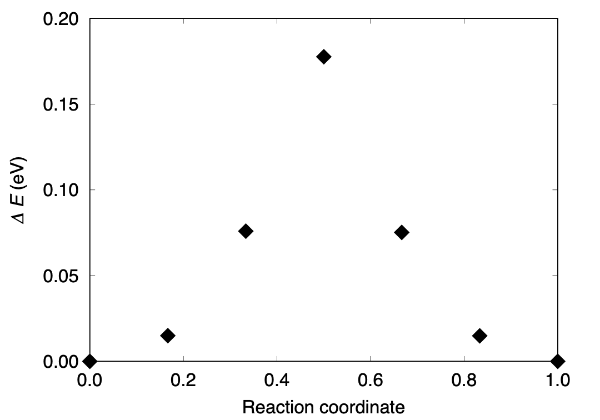

