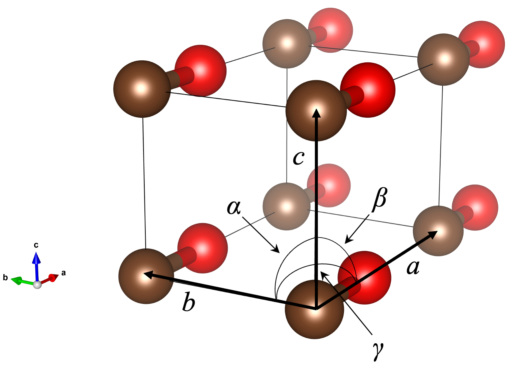

.. _input_description_co:

:orphan:

CO molecule example
===================

By using a carbon monoxide (CO) in a small rectangular box as an example, short description on the input variables is provided here.

``nfinp_scf``::

  WF_OPT    DAV
  NTYP      2
  NATM      2
  GMAX      5.50
  GMAXP     20.00
  NSCF      200
  MIX_ALPHA 0.8
  WIDTH     0.0010
  EDELTA    0.1000D-09
  NEG       8
  CELL      6.00  4.00  4.00  90.00  90.00  90.00
  &ATOMIC_SPECIES
   C  12.011  pot.C_pbe1
   O  15.999  pot.O_pbe1
  &END
  &ATOMIC_COORDINATES
    0.0000  0.0000  0.0000  1  1  1
    2.2000  0.0000  0.0000  1  1  2
  &END

Each input variables and blocks (&[BLOCK_NAME] ... &) are explained below:

.. code:: bash

  WF_OPT    DAV

``WF_OPT`` is used to specify the wave function method. Default is ``DAV``.

.. code:: bash

  NTYP      2

``NTYP`` defines the number of atomic species in the system.

.. code:: bash

  NATM      2

``NATM`` defines the number of atoms in the unit cell.

.. code:: bash

  GMAX      5.50

``GMAX`` is the cutoff wave vector for the plane wave expansion of the wave functions. GMAX**2 corresponds to the cutoff energy in Rydberg (in this case, 30.25 Rydberg (Ry)).

.. code:: bash

  GMAXP     20.00

``GMAXP`` is the cutoff wave vector for the plane wave expansion of charge density. GMAXP**2 corresponds to the cutoff energy in Rydberg (400 Ry).

.. code:: bash

  NSCF      200

``NSCF`` is the maximum number of iteration for the wave function optimization [self-consistent field (SCF)]. Default is 200.

.. code:: bash

  MIX_ALPHA 0.8

``MIX_ALPHA`` is the mixing parameter for the charge density mixing. Default is 0.7.

.. code:: bash

  WIDTH     0.0010

``WIDTH`` is the width of the broadening to approximate the delta function in Hartree. For systems with a gap, very small positive ``WIDTH`` is used. In such a case, it does not have a physical meaning and is used to determine the Fermi level.

.. code:: bash

  EDELTA    0.1000D-09

``EDELTA`` is the convergence threshold for the total energy in Hartree per atom for the SCF calculation.

.. code:: bash

  NEG       8

``NEG`` is the number of states/bands considered in the calculation. STATE does not allow an occupied-state only calculation, and therefore ``NEG`` should be large enough to include occupied states and some unoccupied states.

.. code:: bash

  CELL      6.00  4.00  4.00  90.00  90.00  90.00

``CELL`` defines the cell parameter :math:`a`, :math:`b`, :math:`c`, :math:`\alpha`, :math:`\beta`, and :math:`\gamma`, where :math:`a`, :math:`b`, :math:`c`, are the lengths (in Bohr) of the 1st, 2nd, and 3rd lattice vectors, respectively, and :math:`\alpha`, :math:`\beta`, and :math:`\gamma`, are the angles (in degree) between 2nd and 3rd, 3rd and 1st, and 1st and 2nd lattice vectors, respectively.
See below for pictorial description.

.. code:: bash

  &ATOMIC_SPECIES
   C  12.011  pot.C_pbe1
   O  15.999  pot.O_pbe1
  &END

The block ``&ATOMIC_SPECIES ... &END`` is used to define the atomic types. The syntax is similar to the one in Quantum-ESPRESSO.

 Syntax::

        &ATOMIC_SPECIES
         ATOMIC_NUMBER(1) ATOMIC_MASS(1) PSEUDOPOTENTIAL_FILE(1) 
         ATOMIC_NUMBER(2) ATOMIC_MASS(2) PSEUDOPOTENTIAL_FILE(2) 
         ...
         ATOMIC_NUMBER(NTYP) ATOMIC_MASS(NTYP) PSEUDOPOTENTIAL_FILE(NTYP) 
        &END

 or::

        &ATOMIC_SPECIES
         ATOMIC_SYMBOL(1) ATOMIC_MASS(1) PSEUDOPOTENTIAL_FILE(1) 
         ATOMIC_SYMBOL(2) ATOMIC_MASS(2) PSEUDOPOTENTIAL_FILE(2)
         ...
         ATOMIC_SYMBOL(NTYP) ATOMIC_MASS(NTYP) PSEUDOPOTENTIAL_FILE(NTYP) 
        &END
 
 where ``NTYP`` is the number of atomic species.

.. code:: bash

  &ATOMIC_COORDINATES
    0.0000  0.0000  0.0000  1  1  1
    2.2000  0.0000  0.0000  1  1  2
  &END

The block ``&ATOMIC_COORDINATES ... &END`` is used to define the atomic coordinates in the legacy STATE format.

 Syntax::

        &ATOMIC_COORDINATES [CRYSTAL|CRYS|CARTESIAN|CART]
         CPS(1,1) CPS(1,2) CPS(1,3) IWEI(1) IMDTYP(1) ITYP(1)
         CPS(2,1) CPS(2,2) CPS(2,3) IWEI(2) IMDTYP(2) ITYP(2)
         ...
         CPS(NATM,1) CPS(NATM,2) CPS(NATM,3) IWEI(NATM) IMDTYP(NATM) ITYP(NATM)
        &END
        

 ``CARTESIAN``/``CART``: If set, atomic coordinates are given in the cartesian coordinate

 ``CRYSTAL``/``CRYS``: If set, atomic coordinates are given in the crystal coordinate

 ``CPS``: Atomic coordinate in the cartesian (``NCORD=1`` or ``COORD=CARTESIAN``) or in the crystal (``NCORD=0`` or ``COORD=CRYSTAL``) coordinate

 ``IWEI``: number of equivalent atoms under the inversion symmetry (currently inversion symmetry is disabled and always ``IWEI`` is always set to 1).

 ``IMDTYP``:

 * 1: Allow to move the ion

 * 0: Fix the ion

 Default coordinate system is ``CARTESIAN``. This is chosen when ``&ATOMIC_COORDINATES`` without argument is used.
